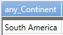
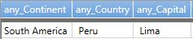

# any() (aggregation function)

Returns random non-empty value from the specified expression values.

This is useful, for example, when some column has a large number of values
(e.g., an "error text" column) and you want to sample that column once per a unique value of the compound group key.

Note that there are *no guarantees* about which record will be returned; the algorithm for selecting
that record is undocumented and one should not assume it is stable.

* Can be used only in context of aggregation inside [summarize](summarizeoperator.md)

**Syntax**

`summarize` `any(` (*Expr* [`,` *Expr2* ...] | `*`) `)` ...

**Arguments**

* *Expr*: Expression that will be used for aggregation calculation. 
* *Expr2* .. *ExprN*: Additional expressions that will be used for aggregation calculation. 

**Returns**

Randomly selects one row of the group and returns the value of the specified expression.

When used used with a single parameter (single column) - `any()` will return a non-null value if such present.

**Examples**

Show Random Continent:

```kusto
Continents | summarize any(Continent)
```




Show all the details for a random row:

```kusto
Continents | summarize any(*) 
```




Show all the details for each random continent:

```kusto
Continents | summarize any(*) by Continent
```

