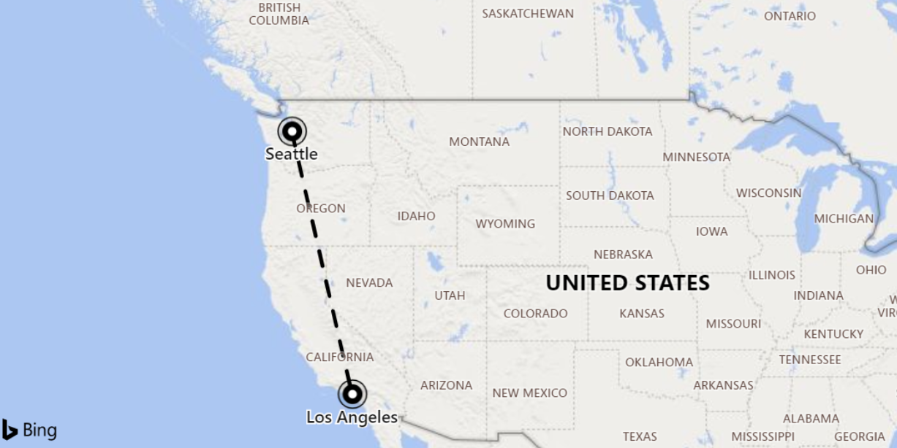

# geo_distance_2points()

The `geo_distance_2points()` function calculates the distance between two geospatial coordinates on Earth.

**Syntax**

`geo_distance_2points(`*p1_longitude*`, `*p1_latitude*`, `*p2_longitude*`, `*p2_latitude*`)`

**Arguments**

* *p1_longitude*: First geospatial coordinate, longitude value in degrees. Valid value is a real number and in range [-180, +180].
* *p1_latitude*: First geospatial coordinate, latitude value in degrees. Valid value is a real number and in range [-90, +90].
* *p2_longitude*: Second geospatial coordinate, longitude value in degrees. Valid value is a real number and in range [-180, +180].
* *p2_latitude*: Second geospatial coordinate, latitude value in degrees. Valid value is a real number and in range [-90, +90].

**Returns**

The distance in meters between two geographic locations on Earth. If the coordinates are invalid, the query will produce a null result.

> [!NOTE]
> * The geospatial coordinates are interpreted as represented by the [WGS-84](https://earth-info.nga.mil/GandG/update/index.php?action=home) coordinate reference system.
> * The [geodetic datum](https://en.wikipedia.org/wiki/Geodetic_datum) used to measure distance on Earth is a sphere.

**Examples**

The following example finds the distance between Seattle and Los Angeles.


<!-- csl: https://help.kusto.windows.net/Samples -->
```
print distance_in_meters = geo_distance_2points(-122.407628, 47.578557, -118.275287, 34.019056)
```

|distance_in_meters|
|---|
|1546754.35197381|

The following example finds all rows in which the distance between two coordinates is between 1 to 11 meters.
<!-- csl: https://help.kusto.windows.net/Samples -->
```
StormEvents
| extend distance_1_to_11m = geo_distance_2points(BeginLon, BeginLat, EndLon, EndLat)
| where distance_1_to_11m between (1 .. 11)
| project Distance = strcat(toint(distance_1_to_11m), " meters"), Description = EventNarrative
```

|Distance|Description|
|---|---|
|10 meters|Flooding was reported at Calle Cerezo and 5 in the municipality of Yabucoa.|
|7 meters|Minor flooding was reported along Route 120 in Rumford.|

The following example will return a null result because of the invalid coordinate input.
<!-- csl: https://help.kusto.windows.net/Samples -->
```
print distance = geo_distance_2points(300,1,1,1)
```

|distance|
|---|
||
