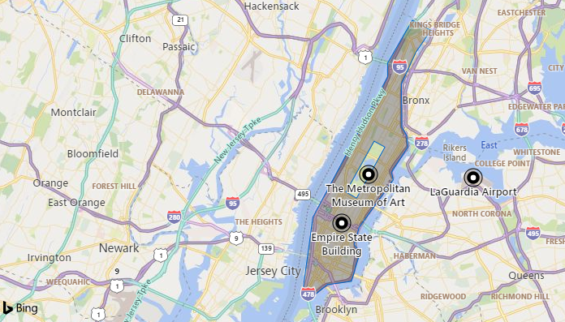
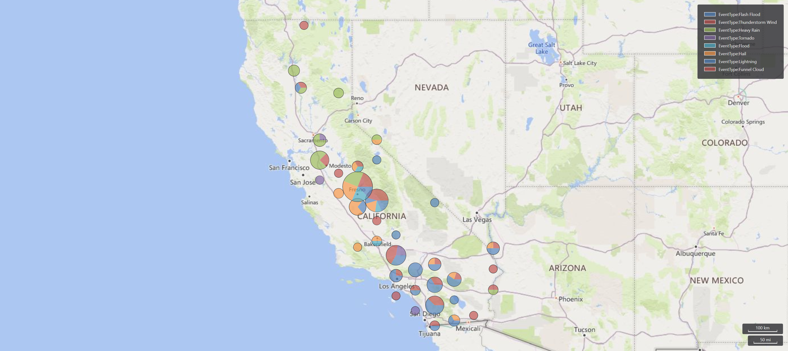

# geo_point_in_polygon()

Calculates whether the geospatial coordinates are inside a polygon on Earth.

**Syntax**

`geo_point_in_polygon(`*longitude*`, `*latitude*`, `*polygon*`)`

**Arguments**

* *longitude*: Geospatial coordinate, longitude value in degrees. Valid value is a real number and in the range [-180, +180].
* *latitude*: Geospatial coordinate, latitude value in degrees. Valid value is a real number and in the range [-90, +90].
* *polygon*: Polygon in the [GeoJSON format](https://tools.ietf.org/html/rfc7946) and of a [dynamic](./scalar-data-types/dynamic.md) data type.

**Returns**

Indicates whether the geospatial coordinates are inside a polygon. If the coordinates or polygon are invalid, the query will produce a null result. 

> [!NOTE]
> * The geospatial coordinates are interpreted as represented by the [WGS-84](https://earth-info.nga.mil/GandG/update/index.php?action=home) coordinate reference system.
> * The [geodetic datum](https://en.wikipedia.org/wiki/Geodetic_datum) used for measurements on Earth is a sphere. Polygon edges are geodesics on the sphere.

**Polygon definition and constraints**

dynamic({"type": "Polygon","coordinates": [ LinearRingShell, LinearRingHole_1 ,..., LinearRingHole_N ]})

* LinearRingShell is required and defined as a `counterclockwise` ordered array of coordinates [[lng_1,lat_1],...,[lng_i,lat_i],...,[lng_j,lat_j],...,[lng_1,lat_1]]. There can be only one shell.
* LinearRingHole is optional and defined as a `clockwise` ordered array of coordinates [[lng_1,lat_1],...,[lng_i,lat_i],...,[lng_j,lat_j],...,[lng_1,lat_1]]. There can be any number of interior rings and holes.
* LinearRing vertices must be distinct with at least three coordinates. The first coordinate must be equal to the last; therefore, at least four entries are required.
* Coordinates [longitude,latitude] must be valid where longitude is a real number in the range [-180, +180] and latitude is a real number inthe range [-90, +90].
* LinearRingShell encloses at most half of the sphere. LinearRing divides the sphere into two regions. The smaller of the two regions will be chosen.
* LinearRing edge length must be less than 180 degrees. The shortest edge between the two vertices will be chosen.
* LinearRings must not cross and must not share edges.LinearRings may share vertices.
* Polygon doesn't necessarily contains its vertices. Point containment in polygon is defined as such that if the Earth is subdivided into polygons, every point is contained by exactly one polygon.

> [!TIP]
> Using literal polygons may result in better performance.

**Examples**

Manhattan island without Central Park


<!-- csl: https://help.kusto.windows.net/Samples -->
```
datatable(longitude:real, latitude:real, place:string)
[
    real(-73.985654), 40.748487, 'Empire State Building',           // In Polygon 
    real(-73.963249), 40.779525, 'The Metropolitan Museum of Art',  // In exterior of polygon
    real(-73.874367), 40.777356, 'LaGuardia Airport',               // In exterior of polygon
]
| where geo_point_in_polygon(longitude, latitude, dynamic({"type":"Polygon","coordinates":[[[-73.92597198486328,40.87821814104651],[-73.94691467285156,40.85069618625578],[-73.94691467285156,40.841865966890786],[-74.01008605957031,40.7519385984599],[-74.01866912841797,40.704586878965245],[-74.01214599609375,40.699901911003046],[-73.99772644042969,40.70875101828792],[-73.97747039794922,40.71083299030839],[-73.97026062011719,40.7290474687069],[-73.97506713867186,40.734510840309376],[-73.970947265625,40.74543623770158],[-73.94210815429688,40.77586181063573],[-73.9434814453125,40.78080140115127],[-73.92974853515625,40.79691751000055],[-73.93077850341797,40.804454347291006],[-73.93489837646484,40.80965166748853],[-73.93524169921875,40.837190668541105],[-73.92288208007812,40.85770758108904],[-73.9101791381836,40.871728144624974],[-73.92597198486328,40.87821814104651]],[[-73.95824432373047,40.80071852197889],[-73.98206233978271,40.76815921628347],[-73.97309303283691,40.76422632379533],[-73.94914627075195,40.796949998204596],[-73.95824432373047,40.80071852197889]]]}))
| project place
```

| place                 |
|-----------------------|
| Empire State Building |

Storm events in California. The events are filtered by california state polygon and aggregated by event type and hash.

<!-- csl: https://help.kusto.windows.net/Samples -->
```
let california = dynamic({"type":"Polygon","coordinates":[[[-123.233256,42.006186],[-122.378853,42.011663],[-121.037003,41.995232],[-120.001861,41.995232],[-119.996384,40.264519],[-120.001861,38.999346],[-118.71478,38.101128],[-117.498899,37.21934],[-116.540435,36.501861],[-115.85034,35.970598],[-114.634459,35.00118],[-114.634459,34.87521],[-114.470151,34.710902],[-114.333228,34.448009],[-114.136058,34.305608],[-114.256551,34.174162],[-114.415382,34.108438],[-114.535874,33.933176],[-114.497536,33.697668],[-114.524921,33.54979],[-114.727567,33.40739],[-114.661844,33.034958],[-114.524921,33.029481],[-114.470151,32.843265],[-114.524921,32.755634],[-114.72209,32.717295],[-116.04751,32.624187],[-117.126467,32.536556],[-117.24696,32.668003],[-117.252437,32.876127],[-117.329114,33.122589],[-117.471515,33.297851],[-117.7837,33.538836],[-118.183517,33.763391],[-118.260194,33.703145],[-118.413548,33.741483],[-118.391641,33.840068],[-118.566903,34.042715],[-118.802411,33.998899],[-119.218659,34.146777],[-119.278905,34.26727],[-119.558229,34.415147],[-119.875891,34.40967],[-120.138784,34.475393],[-120.472878,34.448009],[-120.64814,34.579455],[-120.609801,34.858779],[-120.670048,34.902595],[-120.631709,35.099764],[-120.894602,35.247642],[-120.905556,35.450289],[-121.004141,35.461243],[-121.168449,35.636505],[-121.283465,35.674843],[-121.332757,35.784382],[-121.716143,36.195153],[-121.896882,36.315645],[-121.935221,36.638785],[-121.858544,36.6114],[-121.787344,36.803093],[-121.929744,36.978355],[-122.105006,36.956447],[-122.335038,37.115279],[-122.417192,37.241248],[-122.400761,37.361741],[-122.515777,37.520572],[-122.515777,37.783465],[-122.329561,37.783465],[-122.406238,38.15042],[-122.488392,38.112082],[-122.504823,37.931343],[-122.701993,37.893004],[-122.937501,38.029928],[-122.97584,38.265436],[-123.129194,38.451652],[-123.331841,38.566668],[-123.44138,38.698114],[-123.737134,38.95553],[-123.687842,39.032208],[-123.824765,39.366301],[-123.764519,39.552517],[-123.85215,39.831841],[-124.109566,40.105688],[-124.361506,40.259042],[-124.410798,40.439781],[-124.158859,40.877937],[-124.109566,41.025814],[-124.158859,41.14083],[-124.065751,41.442061],[-124.147905,41.715908],[-124.257444,41.781632],[-124.213628,42.000709],[-123.233256,42.006186]]]});
StormEvents
| project BeginLon, BeginLat, EventType
| where geo_point_in_polygon(BeginLon, BeginLat, california)
| summarize count() by EventType, hash = geo_point_to_s2cell(BeginLon, BeginLat, 7)
| project geo_s2cell_to_central_point(hash), EventType, count_
| render piechart with (kind=map) // map rendering available in Kusto Explorer desktop
```

The following example shows how to classify coordinates to polygons with [partition](./partitionoperator.md) operator.

<!-- csl: https://help.kusto.windows.net/Samples -->
```
let Polygons = datatable(name:string, polygon:dynamic)
[  
  "New York city area", dynamic({"type":"Polygon","coordinates":[[[-73.85009765625,40.85744791303121],[-74.16046142578125,40.84290487729676],[-74.190673828125,40.59935608796518],[-73.83087158203125,40.61812224225511],[-73.85009765625,40.85744791303121]]]}),
  "Seattle area",       dynamic({"type":"Polygon","coordinates":[[[-122.200927734375,47.68573021131587],[-122.4591064453125,47.68573021131587],[-122.4755859375,47.468949677672484],[-122.17620849609374,47.47266286861342],[-122.200927734375,47.68573021131587]]]}),
  "Las Vegas",          dynamic({"type":"Polygon","coordinates":[[[-114.9,36.36],[-115.4498291015625,36.33282808737917],[-115.4498291015625,35.84453450421662],[-114.949951171875,35.902399875143615],[-114.9,36.36]]]}),
];
let Locations = datatable(longitude:real, latitude:real)
[
  real(-73.95),  real(40.75), // Somewhere in New York
  real(-122.3),  real(47.6),  // Somewhere in Seattle
  real(-115.18), real(36.16)  // Somewhere in Las Vegas
];
Polygons
| extend polygonPartition = tostring(pack("location", name, "polygon", polygon))
| partition hint.materialized=true by polygonPartition
{   
     Locations
     | extend location = todynamic(toscalar(polygonPartition)).location
     | extend polygon = todynamic(toscalar(polygonPartition)).polygon
     | where geo_point_in_polygon(longitude, latitude, polygon)
     | project-away polygon
}
```

|longitude|latitude|location|
|---|---|---|
|-73.95|40.75|New York city area|
|-122.3|47.6|Seattle area|
|-115.18|36.16|Las Vegas|

The following example will return a null result because of the invalid coordinate input.

<!-- csl: https://help.kusto.windows.net/Samples -->
```
print in_polygon = geo_point_in_polygon(200,1,dynamic({"type": "Polygon","coordinates": [[[0,0],[10,10],[10,1],[0,0]]]}))
```

| in_polygon |
|------------|
|            |

The following example will return a null result because of the invalid polygon input.

<!-- csl: https://help.kusto.windows.net/Samples -->
```
print in_polygon = geo_point_in_polygon(1,1,dynamic({"type": "Polygon","coordinates": [[[0,0],[10,10],[10,10],[0,0]]]}))
```

| in_polygon |
|------------|
|            |
