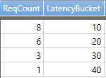
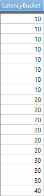
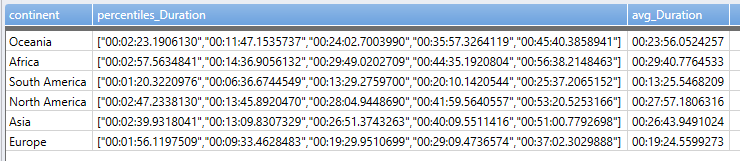

# percentile(), percentiles()

Returns an estimate for the specified [nearest-rank percentile](#nearest-rank-percentile) of the population defined by *Expr*. 
The accuracy depends on the density of population in the region of the percentile.

* Can be used only in context of aggregation inside [summarize](summarizeoperator.md)

`percentiles()` is like `percentile()`, but calculates a number of 
percentile values (which is faster than calculating each percentile individually).

`percentilesw()` is like `percentilew()`, but calculates a number of 
percentile values (which is faster than calculating each percentile individually).

`percentilew()` and `percentilesw()` allows calculating weighted percentiles. Weighted
percentiles calculate the given percentiles in a "weighted" way - threating each value
as if it was repeated `Weight` times in the input.

**Syntax**

summarize `percentile(`*Expr*`,` *Percentile*`)`

summarize `percentiles(`*Expr*`,` *Percentile1* [`,` *Percentile2*]`)`

summarize `percentiles_array(`*Expr*`,` *Percentile1* [`,` *Percentile2*]`)`

summarize `percentiles_array(`*Expr*`,` *Dynamic array*`)`

summarize `percentilew(`*Expr*`,` *WeightExpr*`,` *Percentile*`)`

summarize `percentilesw(`*Expr*`,` *WeightExpr*`,` *Percentile1* [`,` *Percentile2*]`)`

summarize `percentilesw_array(`*Expr*`,` *WeightExpr*`,` *Percentile1* [`,` *Percentile2*]`)`

summarize `percentilesw_array(`*Expr*`,` *WeightExpr*`,` *Dynamic array*`)`

**Arguments**

* *Expr*: Expression that will be used for aggregation calculation.
* *WeightExpr*: Expression that will be used as the weight of values for aggregation calculation.
* *Percentile* is a double constant that specifies the percentile.
* *Dynamic array*: list of percentiles in a dynamic array of integer or floating point numbers

**Returns**

Returns an estimate for *Expr* of the specified percentiles in the group. 

**Examples**

The value of `Duration` that is larger than 95% of the sample set and smaller than 5% of the sample set:

```kusto
CallDetailRecords | summarize percentile(Duration, 95) by continent
```

Simultaneously calculate 5, 50 (median) and 95:

```kusto
CallDetailRecords 
| summarize percentiles(Duration, 5, 50, 95) by continent
```


The results show that in Europe, 5% of calls are shorter than 11.55s, 50% of calls are shorter than 3 minutes 18.46 seconds, and 95% of calls are shorter than 40 minutes 48 seconds.

Calculate multiple statistics:

```kusto
CallDetailRecords 
| summarize percentiles(Duration, 5, 50, 95), avg(Duration)
```

## Weighted percentiles

Assume you measure the time (Duration) it takes an action to complete again and again, and
then instead of recording each and every value of the measurement, you "condense" them by
recording each value of Duration rounded to 100 msec and how many times that rounded value
appeared (BucketSize).

You can use `summarize percentilesw(Duration, BucketSize, ...)` to calculates the given
percentiles in a "weighted" way - treating each value of Duration as if it was repeated
BucketSize times in the input, without actually needing to materialize those records.

Consider the following following example.
A customer has a set of latency values in milliseconds:
`{ 1, 1, 2, 2, 2, 5, 7, 7, 12, 12, 15, 15, 15, 18, 21, 22, 26, 35 }`.

In order to reduce bandwidth and storage, the customer performs pre-aggregation to the
following buckets: `{ 10, 20, 30, 40, 50, 100 }`, and counts the number of events in each bucket,
which gives the following Kusto table:



Which can be read as:
 - 8 events in the 10ms bucket (corresponding to subset `{ 1, 1, 2, 2, 2, 5, 7, 7 }`)
 - 6 events in the 20ms bucket (corresponding to subset `{ 12, 12, 15, 15, 15, 18 }`)
 - 3 events in the 30ms bucket (corresponding to subset `{ 21, 22, 26 }`)
 - 1 event in the 40ms bucket (corresponding to subset `{ 35 }`)

At this point, the original data is no longer available to us, and all we have is the
number of events in each bucket. In order to compute percentiles from this data,
we can use the `percentilesw()` function. For example, for the 50,
75 and 99.9 percentiles, we'll use the following query: 

```kusto
Table
| summarize percentilesw(LatencyBucket, ReqCount, 50, 75, 99.9) 
```

The result for the above query is:


Notice, that the above query corresponds to the function
`percentiles(LatencyBucket, 50, 75, 99.9)` if the data was expended to the following form:



## Getting multiple percentiles in an array
Multiple percentiles percentiles can be obtained as an array in a single dynamic column instead of multiple columns: 

```kusto
CallDetailRecords 
| summarize percentiles_array(Duration, 5, 25, 50, 75, 95), avg(Duration)
```



Similarily weighted percentiles can be returned as a dynamic array using `percentilesw_array`

Percentiles for `percentiles_array` and `percentilesw_array` can be specified in a dynamic array of integer or floating-point numbers. The array must be constant but does not have to be literal.

```kusto
CallDetailRecords 
| summarize percentiles_array(Duration, dynamic([5, 25, 50, 75, 95])), avg(Duration)
```

```kusto
CallDetailRecords 
| summarize percentiles_array(Duration, range(0, 100, 5)), avg(Duration)
```
## Nearest-rank percentile
*P*-th percentile (0 < *P* <= 100) of a list of ordered values (sorted from least to greatest) is the smallest value in the list such that *P* percent of the data is less or equal to that value ([from Wikipedia article on percentiles](https://en.wikipedia.org/wiki/Percentile#The_Nearest_Rank_method))

We also define *0*-th percentiles to be the smallest member of the population.

**Note**
* Given the approximating nature of the calculation the actual returned value may not be a member of the population
* Nearest-rank definition means that *P*=50 does not conform to the [interpolative definition of the median](https://en.wikipedia.org/wiki/Median). When evaluating the significance of this discrepancy for the specific application the size of the population and an [estimation error](#estimation-error-in-percentiles) should be taken into account. 

## Estimation error in percentiles

The percentiles aggregate provides an approximate value using [T-Digest](https://github.com/tdunning/t-digest/blob/master/docs/t-digest-paper/histo.pdf). 

A few important points: 

* The bounds on the estimation error vary with the value of the requested percentile. The best accuracy is at the ends of [0..100] scale, percentiles 0 and 100 are the exact minimum and maximum values of the distribution. The accuracy gradually decreases towards the middle of the scale. It is worst at the median and is capped at 1%. 
* Error bounds are observed on the rank, not on the value. Suppose percentile(X, 50) returned value of Xm. The estimation guarantees that at least 49% and at most 51% of the values of X are less or equal to Xm. There is no theoretical limit on the difference  between Xm and actual median value of X.
* The estimation may sometimes result in a precise value but there are no reliable conditions to define when it will be the case