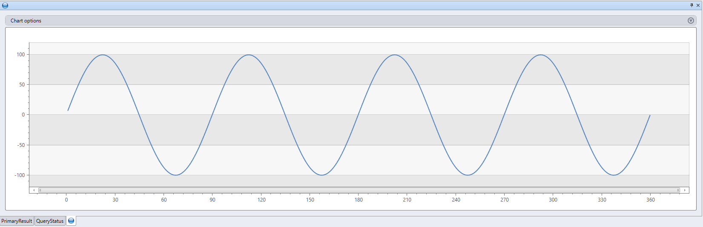

# Python plugin

::: zone pivot="azuredataexplorer"

The Python plugin runs a user-defined-function (UDF) using a Python script. The Python script gets tabular data as its input, and is expected to produce a tabular output.
The plugin's runtime is hosted in [sandboxes](../concepts/sandboxes.md), running on the cluster's nodes.

## Syntax

*T* `|` `evaluate` [`hint.distribution` `=` (`single` | `per_node`)] `python(`*output_schema*`,` *script* [`,` *script_parameters*][`,` *external_artifacts*]`)`

## Arguments

* *output_schema*: A `type` literal that defines the output schema of the tabular data, returned by the Python code.
    * The format is: `typeof(`*ColumnName*`:` *ColumnType* [, ...]`)`, for example: `typeof(col1:string, col2:long)`.
    * For extending the input schema, use the following syntax: `typeof(*, col1:string, col2:long)`
* *script*: A `string` literal that is the valid Python script to be executed.
* *script_parameters*: An optional `dynamic` literal, which is a property bag of name/value pairs to be passed to the
   Python script as the reserved `kargs` dictionary (see [Reserved Python variables](#reserved-python-variables)).
* *hint.distribution*: An optional hint for the plugin's execution to be distributed across multiple cluster nodes.
  * The default value is `single`.
  * `single`: A single instance of the script will run over the entire query data.
  * `per_node`: If the query before the Python block is distributed, an instance of the script will run on each node over the data that it contains.
* *external_artifacts*: An optional `dynamic` literal which is a property bag of name & URL pairs for artifacts that are accessible from cloud storage and can be made available for the script to use at runtime.
  * URLs referenced in this property bag are required to:
  * Be included in the cluster's [callout policy](../management/calloutpolicy.md).
    2. Being in a publicly available location, or provide the necessary credentials, as explained in [Storage connection strings](../api/connection-strings/storage.md).
  * The artifacts are made available for the script to consume from a local temporary directory, `.\Temp`, and the names provided in the property bag are used as the local file names (see [example](#examples) below).
  * For more information, see [appendix](#appendix-installing-packages-for-the-python-plugin) below.

## Reserved Python variables

The following variables are reserved for interaction between Kusto query language and the Python code:

* `df`: The input tabular data (the values of `T` above), as a `pandas` DataFrame.
* `kargs`: The value of the *script_parameters* argument, as a Python dictionary.
* `result`: A `pandas` DataFrame created by the Python script whose value becomes the tabular data that gets sent to the Kusto query operator that follows the plugin.

## Onboarding

* The plugin is disabled by default.
* Prerequisites for enabling the plugin are listed [here](../concepts/sandboxes.md#prerequisites).
* Enable or disable the plugin in the [Azure portal in the **Configuration** tab of your cluster](https://docs.microsoft.com/azure/data-explorer/language-extensions).

## Notes and Limitations

* The Python sandbox image is based on *Anaconda 5.2.0* distribution with *Python 3.6* engine.
  The list of its packages can be found [here](http://docs.anaconda.com/anaconda/packages/old-pkg-lists/5.2.0/py3.6_win-64/)
  (a small percentage of packages might be incompatible with the limitations enforced by the sandbox in which the plugin is run).
* The Python image also contains common ML packages: `tensorflow`, `keras`, `torch`, `hdbscan`, `xgboost` and other useful packages.
* The plugin imports *numpy* (as `np`) & *pandas* (as `pd`) by default.  You can import other modules as needed.
* **[Ingestion from query](../management/data-ingestion/ingest-from-query.md) and [Update policies](../management/updatepolicy.md)**
  * It is possible to use the plugin in queries which are:
      1. Defined as part of an update policy, whose source table is ingested to using *non-streaming* ingestion.
      2. Run as part of a command which ingests from a query (e.g. `.set-or-append`).
  * In both the above cases, it's recommended to verify that the volume and frequency of the ingestion, as well as the complexity and
    resources utilization of the Python logic are aligned with [sandbox limitations](../concepts/sandboxes.md#limitations), and the cluster's available resources.
    Failure to do so may result with [throttling errors](../concepts/sandboxes.md#errors).
  * It is *not* possible to use the plugin in a query which is defined as part of an update policy, whose source table is ingested using [streaming ingestion](https://docs.microsoft.com/azure/data-explorer/ingest-data-streaming).

## Examples

<!-- csl -->
```
range x from 1 to 360 step 1
| evaluate python(
//
typeof(*, fx:double),               //  Output schema: append a new fx column to original table 
//
'result = df\n'                     //  The Python decorated script
'n = df.shape[0]\n'
'g = kargs["gain"]\n'
'f = kargs["cycles"]\n'
'result["fx"] = g * np.sin(df["x"]/n*2*np.pi*f)\n'
//
, pack('gain', 100, 'cycles', 4)    //  dictionary of parameters
)
| render linechart 
```



<!-- csl -->
```
print "This is an example for using 'external_artifacts'"
| evaluate python(
    typeof(File:string, Size:string),
    "import os\n"
    "result = pd.DataFrame(columns=['File','Size'])\n"
    "sizes = []\n"
    "path = '.\\\\Temp'\n"
    "files = os.listdir(path)\n"
    "result['File']=files\n"
    "for file in files:\n"
    "    sizes.append(os.path.getsize(path + '\\\\' + file))\n"
    "result['Size'] = sizes\n"
    "\n",
    external_artifacts = 
        dynamic({"this_is_my_first_file":"https://raw.githubusercontent.com/yonileibowitz/kusto.blog/master/resources/R/sample_script.r",
                 "this_is_a_script":"https://raw.githubusercontent.com/yonileibowitz/kusto.blog/master/resources/python/sample_script.py"})
)
```

| File                  | Size |
|-----------------------|------|
| this_is_a_script      | 120  |
| this_is_my_first_file | 105  |

## Performance tips

* Reduce the plugin's input data set to the minimum amount required (columns/rows).
    * Use filters on the source data set, when possible, with Kusto's query language.
    * To perform a calculation on a subset of the source columns, project only those column before invoking the plugin.
* Use `hint.distribution = per_node` whenever the logic in your script is distributable.
    * You can also use the [partition operator](partitionoperator.md) for partitioning the input data set.
* Use Kusto's query language, whenever possible, to implement the logic of your Python script.

    Example:

    <!-- csl -->
    ```    
    .show operations
    | where StartedOn > ago(7d) // Filtering out irrelevant records before invoking the plugin
    | project d_seconds = Duration / 1s // Projecting only a subset of the necessary columns
    | evaluate hint.distribution = per_node python( // Using per_node distribution, as the script's logic allows it
        typeof(*, _2d:double),
        'result = df\n'
        'result["_2d"] = 2 * df["d_seconds"]\n' // Negative example: this logic should have been written using Kusto's query language
      )
    | summarize avg = avg(_2d)
    ```

## Usage tips

* To generate multi-line strings containing the Python script in `Kusto.Explorer`, copy your Python script from your favorite
  Python editor (*Jupyter*, *Visual Studio Code*, *PyCharm*, etc.), then either:
    * Press *F2* to open the **Edit in Python** window. Paste the script into this window. Select **OK**. The script will be
      decorated with quotes and new lines (so it's valid in Kusto) and automatically pasted into the query tab.
    * Paste the Python code directly into the query tab, select those lines and press *Ctrl+K*, *Ctrl+S* hot key to decorate them as
      above (to reverse it press *Ctrl+K*, *Ctrl+M* hot key). [Here](../tools/kusto-explorer-shortcuts.md#query-editor) is the full list of
      Query Editor shortcuts.
* To avoid conflicts between Kusto string delimiters and Python string literals, we recommend using single quote characters (`'`) for Kusto string 
  literals in Kusto queries, and double quote characters (`"`) for Python string literals in Python scripts.
* Use the [externaldata operator](externaldata-operator.md) to obtain the content of a script that you've stored in an external location, such as Azure Blob storage or a public GitHub repository.
  
    **Example**

    <!-- csl -->
    ```    
    let script = 
        externaldata(script:string)
        [h'https://raw.githubusercontent.com/yonileibowitz/kusto.blog/master/resources/python/sample_script.py']
        with(format = raw);
    range x from 1 to 360 step 1
    | evaluate python(
        typeof(*, fx:double),
        toscalar(script), 
        pack('gain', 100, 'cycles', 4))
    | render linechart 
    ```

## Appendix: Installing packages for the Python plugin

You may need to self install package(s) due to any of the following reasons:

* The package is private and is your own.
* The package is public but isn't included in the plugin's base image.

You can install packages by following these steps:

1. One-time prerequisite:
  
  a. Create a blob container to host the package(s), preferably at the same region as your cluster.
    * For example: https://artifcatswestus.blob.core.windows.net/python (assuming your cluster is in West US)
  
  b. Alter the cluster's [Callout policy](../management/calloutpolicy.md) to allow accessing that location.
    * This requires [AllDatabasesAdmin](../management/access-control/role-based-authorization.md) permissions.
    * For example, to enable access to a blob located in https://artifcatswestus.blob.core.windows.net/python, the command to run is:

      <!-- csl -->
      ```
      .alter-merge cluster policy callout @'[ { "CalloutType": "sandbox_artifacts", "CalloutUriRegex": "artifcatswestus\\.blob\\.core\\.windows\\.net/python/","CanCall": true } ]'
      ```

2. For public packages (in [PyPi](https://pypi.org/) or other channels)
  a. Download the package and its dependencies.
  b. If required, compile to wheel (`*.whl`) files:
    * From a cmd window (in your local Python environment) run:
      ```python
      pip wheel [-w download-dir] package-name.
      ```

3. Create a zip file, containing the required package and its dependencies:

    * For public packages: zip the files that were downloaded in the previous step.
    * Notes:
        * Make sure to zip the `.whl` files themselves and *not* their parent folder.
        * You can skip `.whl` files for packages that already exist with the same version in the base sandbox image.
    * For private packages: zip the folder of the package and those of its dependencies

4. Upload the zipped file to a blob in the artifacts location (from step 1.).

5. Calling the `python` plugin:
    * Specify the `external_artifacts` parameter with a property bag of name and reference to the zip file (the blob's URL).
    * In your inline python code: import `Zipackage` from `sandbox_utils` and call its `install()` method with the name of the zip file.

### Example

Installing the [Faker](https://pypi.org/project/Faker/) package that generates fake data:

<!-- csl -->
```
range Id from 1 to 3 step 1 
| extend Name=''
| evaluate python(typeof(*),
    'from sandbox_utils import Zipackage\n'
    'Zipackage.install("Faker.zip")\n'
    'from faker import Faker\n'
    'fake = Faker()\n'
    'result = df\n'
    'for i in range(df.shape[0]):\n'
    '    result.loc[i, "Name"] = fake.name()\n',
    external_artifacts=pack('faker.zip', 'https://artifacts.blob.core.windows.net/kusto/Faker.zip?...'))
```

| Id | Name         |
|----|--------------|
|   1| Gary Tapia   |
|   2| Emma Evans   |
|   3| Ashley Bowen |

---

::: zone-end

::: zone pivot="azuremonitor"

This isn't supported in Azure Monitor

::: zone-end
